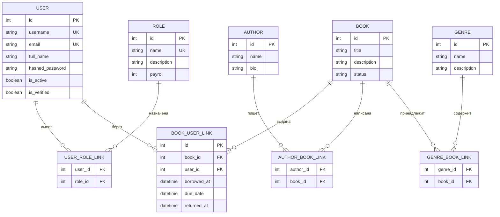

# LiB

Веб-приложение библиотеки на FastAPI с современным REST API и веб-интерфейсом. Использует Pydantic для валидации данных, SQLModel для работы с базой данных, Alembic для миграций, PostgreSQL как СУБД и Docker Compose для развертывания.

### **Ключевые технологии:**

1. **FastAPI**: Высокопроизводительный веб-фреймворк для создания RESTful API с автоматической генерацией документации
2. **Pydantic**: Валидация данных и сериализация с использованием аннотаций типов Python
3. **SQLModel**: Объединение SQLAlchemy и Pydantic для работы с БД через классы Python
4. **Alembic**: Инструмент для управления миграциями базы данных
5. **PostgreSQL**: Надежная реляционная база данных
6. **Docker Compose**: Упрощенное развертывание приложения и зависимостей в контейнерах
7. **Tailwind CSS**: CSS-фреймворк для стилизации интерфейса
8. **Alpine.js**: Легковесный JavaScript-фреймворк для реактивности
9. **Chart.js**: Библиотека для визуализации данных

### **Инструкция по установке**

1. Клонируйте репозиторий:
   ```bash
   git clone https://github.com/wowlikon/libraryapi.git
   ```

2. Перейдите в каталог проекта:
   ```bash
   cd libraryapi
   ```

3. Настройте переменные окружения:
   ```bash
   edit .env
   ```

4. Соберите контейнеры Docker:
   ```bash
   docker compose build
   ```

5. Запустите приложение:
   ```bash
   docker compose up api -d
   ```

Для создания новых миграций:
   ```bash
   alembic revision --autogenerate -m "Migration name"
   ```

Для запуска тестов:
   ```bash
   docker compose up test
   ```

Для добавления данных для примера используйте:
  ```bash
  python data.py
  ```

### **Роли пользователей**

- **Админ**: Полный доступ ко всем функциям системы
- **librarian**: Управление книгами, авторами, жанрами и выдачами
- **member**: Просмотр каталога и управление своими выдачами

### **Эндпоинты API**

#### **Аутентификация** (`/api/auth`)

| Метод  | Эндпоинт                     | Доступ         | Описание                                 |
|--------|------------------------------|----------------|------------------------------------------|
| POST   | `/register`                  | Публичный      | Регистрация нового пользователя          |
| POST   | `/token`                     | Публичный      | Получение JWT токенов (access + refresh) |
| POST   | `/refresh`                   | Публичный      | Обновление пары токенов                  |
| GET    | `/me`                        | Авторизованный | Информация о текущем пользователе        |
| PUT    | `/me`                        | Авторизованный | Обновление профиля текущего пользователя |
| GET    | `/2fa`                       | Авторизованный | Создаёт QR-код для включения 2FA         |
| POST   | `/2fa/verify`                | Неполный вход  | Завершает вход при включеной 2FA         |
| POST   | `/2fa/enable`                | Авторизованный | Включает двухваткорную аутентификацию    |
| POST   | `/2fa/disable`               | Авторизованный | Выключает двухваткорную аутентификацию   |
| GET    | `/recovery-codes/status`     | Авторизованный | Проверяет состояние кодов восстановления |
| POST   | `/recovery-codes/regenerate` | Авторизованный | Пересоздает коды восстановления пароля   |
| POST   | `/password/reset`            | Публичный      | Сброс пароля с помощью одноразового кода |

#### **Авторы** (`/api/authors`)

| Метод  | Эндпоинт | Доступ    | Описание                        |
|--------|----------|-----------|---------------------------------|
| POST   | `/`      | Сотрудник | Создать нового автора           |
| GET    | `/`      | Публичный | Получить список всех авторов    |
| GET    | `/{id}`  | Публичный | Получить автора по ID с книгами |
| PUT    | `/{id}`  | Сотрудник | Обновить автора по ID           |
| DELETE | `/{id}`  | Сотрудник | Удалить автора по ID            |

#### **Книги** (`/api/books`)

| Метод  | Эндпоинт  | Доступ    | Описание                                     |
|--------|-----------|-----------|----------------------------------------------|
| POST   | `/`       | Сотрудник | Создать новую книгу                          |
| GET    | `/`       | Публичный | Получить список всех книг                    |
| GET    | `/{id}`   | Публичный | Получить книгу по ID с авторами и жанрами    |
| PUT    | `/{id}`   | Сотрудник | Обновить книгу по ID                         |
| DELETE | `/{id}`   | Сотрудник | Удалить книгу по ID                          |
| GET    | `/filter` | Публичный | Фильтрация книг по названию, авторам, жанрам |

#### **Жанры** (`/api/genres`)

| Метод  | Эндпоинт | Доступ    | Описание                      |
|--------|----------|-----------|-------------------------------|
| POST   | `/`      | Сотрудник | Создать новый жанр            |
| GET    | `/`      | Публичный | Получить список всех жанров   |
| GET    | `/{id}`  | Публичный | Получить жанр по ID с книгами |
| PUT    | `/{id}`  | Сотрудник | Обновить жанр по ID           |
| DELETE | `/{id}`  | Сотрудник | Удалить жанр по ID            |

#### **Выдачи** (`/api/loans`)

| Метод  | Эндпоинт                | Доступ         | Описание                                                   |
|--------|-------------------------|----------------|------------------------------------------------------------|
| POST   | `/`                     | Авторизованный | Создать выдачу/бронь (читатели на себя, cотрудник на всех) |
| GET    | `/`                     | Авторизованный | Список выдач (читатели видят свои, Сотрудник видят все)    |
| GET    | `{id}`                  | Авторизованный | Получить выдачу по ID (читатели только свои)               |
| PUT    | `{id}`                  | Авторизованный | Обновить выдачу (читатели только свои)                     |
| DELETE | `{id}`                  | Авторизованный | Удалить выдачу/бронь (только для RESERVED статуса)         |
| POST   | `{id}/confirm`          | Сотрудник      | Подтвердить бронь (меняет статус на BORROWED)              |
| POST   | `{id}/return`           | Сотрудник      | Вернуть книгу и закрыть выдачу                             |
| GET    | `book/{book_id}/active` | Сотрудник      | Получить активную выдачу книги                             |
| POST   | `issue`                 | Админ          | Выдать книгу напрямую без бронирования                     |
| GET    | `analytics`             | Админ          | Аналитика выдач и возвратов                                |

#### **Связи** (`/api`)

| Метод  | Эндпоинт                     | Доступ    | Описание                      |
|--------|------------------------------|-----------|-------------------------------|
| POST   | `/relationships/author-book` | Сотрудник | Связать автора и книгу        |
| DELETE | `/relationships/author-book` | Сотрудник | Удалить связь автор-книга     |
| GET    | `/authors/{id}/books`        | Публичный | Получить список книг автора   |
| GET    | `/books/{id}/authors`        | Публичный | Получить список авторов книги |
| POST   | `/relationships/genre-book`  | Сотрудник | Связать жанр и книгу          |
| DELETE | `/relationships/genre-book`  | Сотрудник | Удалить связь жанр-книга      |
| GET    | `/genres/{id}/books`         | Публичный | Получить список книг жанра    |
| GET    | `/books/{id}/genres`         | Публичный | Получить список жанров книги  |


#### **Пользователи** (`/api/users`)

| Метод  | Эндпоинт                      | Доступ         | Описание                     |
|--------|-------------------------------|----------------|------------------------------|
| POST   | `/`                           | Админ          | Создать нового пользователя  |
| GET    | `/`                           | Админ          | Список всех пользователей    |
| GET    | `/{id}`                        | Админ          | Получить пользователя по ID  |
| PUT    | `/{id}`                        | Админ          | Обновить пользователя по ID  |
| DELETE | `/{id}`                        | Админ          | Удалить пользователя по ID   |
| POST   | `/{user_id}/roles/{role_name}` | Админ          | Назначение роли пользователю |
| DELETE | `/{user_id}/roles/{role_name}` | Админ          | Удаление роли у пользователя |
| GET    | `/roles`                       | Авторизованный | Список ролей в системе       |


#### **Прочее** (`/api`)

| Метод | Эндпоинт | Доступ    | Описание             |
|-------|----------|-----------|----------------------|
| GET   | `/info`  | Публичный | Информация о сервисе |
| GET   | `/stats` | Публичный | Статистика системы   |

### **Веб-страницы**

| Путь                | Доступ         | Описание                    |
|---------------------|----------------|-----------------------------|
| `/`                 | Публичный      | Главная страница            |
| `/api`              | Публичный      | Ссылки на документацию      |
| `/auth`             | Публичный      | Страница авторизации        |
| `/profile`          | Авторизованный | Профиль пользователя        |
| `/books`            | Публичный      | Каталог книг с фильтрацией  |
| `/book/{id}`        | Публичный      | Страница просмотра книги    |
| `/book/create`      | Сотрудник      | Создание новой книги        |
| `/book/{id}/edit`   | Сотрудник      | Редактирование книги        |
| `/authors`          | Публичный      | Список авторов              |
| `/author/{id}`      | Публичный      | Страница автора             |
| `/author/create`    | Сотрудник      | Создание автора             |
| `/author/{id}/edit` | Сотрудник      | Редактирование автора       |
| `/genre/create`     | Сотрудник      | Создание жанра              |
| `/genre/{id}/edit`  | Сотрудник      | Редактирование жанра        |
| `/my-books`         | Авторизованный | Мои выдачи                  |
| `/users`            | Админ          | Управление пользователями   |
| `/analytics`        | Админ          | Аналитика выдач и возвратов |


### **Схема базы данных**



### **Статусы книг**

- **ACTIVE**: Книга доступна для выдачи
- **RESERVED**: Книга забронирована (ожидает подтверждения)
- **BORROWED**: Книга выдана пользователю

### **Используемые технологии**

- **FastAPI**: Современный веб-фреймворк для построения API на Python
- **Pydantic**: Библиотека для валидации данных и управления настройками
- **SQLModel**: Библиотека для взаимодействия с базами данных, объединяющая SQLAlchemy и Pydantic
- **Alembic**: Инструмент для миграции базы данных на основе SQLAlchemy
- **PostgreSQL**: Реляционная система управления базами данных
- **Docker**: Платформа для разработки, распространения и запуска приложений в контейнерах
- **Docker Compose**: Инструмент для определения и запуска многоконтейнерных приложений Docker
- **Tailwind CSS**: CSS-фреймворк для стилизации интерфейса
- **Alpine.js**: Легковесный JavaScript-фреймворк для реактивности
- **Chart.js**: Библиотека для визуализации данных
