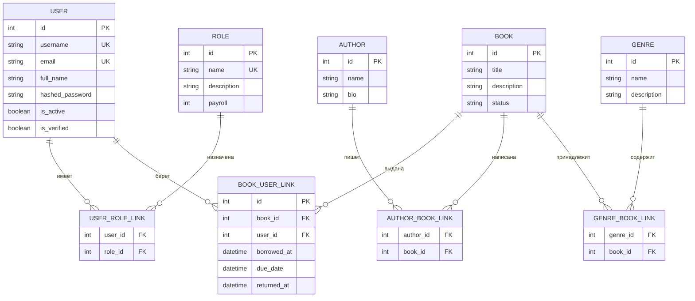

# LiB

Веб-приложение библиотеки на FastAPI с современным REST API и веб-интерфейсом. Использует Pydantic для валидации данных, SQLModel для работы с базой данных, Alembic для миграций, PostgreSQL как СУБД и Docker Compose для развертывания.

### **Ключевые технологии:**

1. **FastAPI**: Высокопроизводительный веб-фреймворк для создания RESTful API с автоматической генерацией документации
2. **Pydantic**: Валидация данных и сериализация с использованием аннотаций типов Python
3. **SQLModel**: Объединение SQLAlchemy и Pydantic для работы с БД через классы Python
4. **Alembic**: Инструмент для управления миграциями базы данных
5. **PostgreSQL**: Надежная реляционная база данных
6. **Docker Compose**: Упрощенное развертывание приложения и зависимостей в контейнерах
7. **Tailwind CSS**: CSS-фреймворк для стилизации интерфейса
8. **Alpine.js**: Легковесный JavaScript-фреймворк для реактивности
9. **Chart.js**: Библиотека для визуализации данных

### **Инструкция по установке**

1. Клонируйте репозиторий:
   ```bash
   git clone https://github.com/wowlikon/libraryapi.git
   ```

2. Перейдите в каталог проекта:
   ```bash
   cd libraryapi
   ```

3. Настройте переменные окружения:
   ```bash
   edit .env
   ```

4. Соберите контейнеры Docker:
   ```bash
   docker compose build
   ```

5. Запустите приложение:
   ```bash
   docker compose up api -d
   ```

Для создания новых миграций:
   ```bash
   alembic revision --autogenerate -m "Migration name"
   ```

Для запуска тестов:
   ```bash
   docker compose up test
   ```

Для добавления данных для примера используйте:
  ```bash
  python data.py
  ```

### **Роли пользователей**

- **Админ**: Полный доступ ко всем функциям системы
- **librarian**: Управление книгами, авторами, жанрами и выдачами
- **member**: Просмотр каталога и управление своими выдачами

### **Эндпоинты API**

#### **Аутентификация** (`/api/auth`)

| Метод  | Эндпоинт                                      | Доступ         | Описание                                 |
|--------|-----------------------------------------------|----------------|------------------------------------------|
| POST   | `/api/auth/register`                          | Публичный      | Регистрация нового пользователя          |
| POST   | `/api/auth/token`                             | Публичный      | Получение JWT токенов (access + refresh) |
| POST   | `/api/auth/refresh`                           | Публичный      | Обновление пары токенов                  |
| GET    | `/api/auth/me`                                | Авторизованный | Информация о текущем пользователе        |
| PUT    | `/api/auth/me`                                | Авторизованный | Обновление профиля текущего пользователя |
| GET    | `/api/auth/users`                             | Сотрудник      | Список всех пользователей                |
| POST   | `/api/auth/users/{user_id}/roles/{role_name}` | Админ          | Назначение роли пользователю             |
| DELETE | `/api/auth/users/{user_id}/roles/{role_name}` | Админ          | Удаление роли у пользователя             |
| GET    | `/api/auth/roles`                             | Авторизованный | Список ролей в системе                   |

#### **Авторы** (`/api/authors`)

| Метод  | Эндпоинт            | Доступ    | Описание                        |
|--------|---------------------|-----------|---------------------------------|
| POST   | `/api/authors`      | Сотрудник | Создать нового автора           |
| GET    | `/api/authors`      | Публичный | Получить список всех авторов    |
| GET    | `/api/authors/{id}` | Публичный | Получить автора по ID с книгами |
| PUT    | `/api/authors/{id}` | Сотрудник | Обновить автора по ID           |
| DELETE | `/api/authors/{id}` | Сотрудник | Удалить автора по ID            |

#### **Книги** (`/api/books`)

| Метод  | Эндпоинт            | Доступ    | Описание                                                  |
|--------|---------------------|-----------|-----------------------------------------------------------|
| GET    | `/api/books/filter` | Публичный | Фильтрация книг по названию, авторам, жанрам с пагинацией |
| POST   | `/api/books`        | Сотрудник | Создать новую книгу                                       |
| GET    | `/api/books`        | Публичный | Получить список всех книг                                 |
| GET    | `/api/books/{id}`   | Публичный | Получить книгу по ID с авторами и жанрами                 |
| PUT    | `/api/books/{id}`   | Сотрудник | Обновить книгу по ID                                      |
| DELETE | `/api/books/{id}`   | Сотрудник | Удалить книгу по ID                                       |

#### **Жанры** (`/api/genres`)

| Метод  | Эндпоинт           | Доступ    | Описание                      |
|--------|--------------------|-----------|-------------------------------|
| POST   | `/api/genres`      | Сотрудник | Создать новый жанр            |
| GET    | `/api/genres`      | Публичный | Получить список всех жанров   |
| GET    | `/api/genres/{id}` | Публичный | Получить жанр по ID с книгами |
| PUT    | `/api/genres/{id}` | Сотрудник | Обновить жанр по ID           |
| DELETE | `/api/genres/{id}` | Сотрудник | Удалить жанр по ID            |

#### **Выдачи** (`/api/loans`)

| Метод  | Эндпоинт                           | Доступ         | Описание                                                     |
|--------|------------------------------------|----------------|--------------------------------------------------------------|
| POST   | `/api/loans`                       | Авторизованный | Создать выдачу/бронь (читатели для себя, Сотрудник для всех) |
| GET    | `/api/loans`                       | Авторизованный | Список выдач (читатели видят свои, Сотрудник видят все)      |
| GET    | `/api/loans/analytics`             | Админ          | Аналитика выдач и возвратов                                  |
| GET    | `/api/loans/{id}`                  | Авторизованный | Получить выдачу по ID (читатели только свои)                 |
| PUT    | `/api/loans/{id}`                  | Авторизованный | Обновить выдачу (читатели только свои)                       |
| POST   | `/api/loans/{id}/confirm`          | Сотрудник      | Подтвердить бронь (меняет статус на BORROWED)                |
| POST   | `/api/loans/{id}/return`           | Сотрудник      | Вернуть книгу и закрыть выдачу                               |
| DELETE | `/api/loans/{id}`                  | Авторизованный | Удалить выдачу/бронь (только для RESERVED статуса)           |
| GET    | `/api/loans/book/{book_id}/active` | Сотрудник      | Получить активную выдачу книги                               |
| POST   | `/api/loans/issue`                 | Админ          | Выдать книгу напрямую без бронирования                       |

#### **Связи** (`/api`)

| Метод  | Эндпоинт                         | Доступ    | Описание                      |
|--------|----------------------------------|-----------|-------------------------------|
| POST   | `/api/relationships/author-book` | Сотрудник | Связать автора и книгу        |
| DELETE | `/api/relationships/author-book` | Сотрудник | Удалить связь автор-книга     |
| GET    | `/api/authors/{id}/books`        | Публичный | Получить список книг автора   |
| GET    | `/api/books/{id}/authors`        | Публичный | Получить список авторов книги |
| POST   | `/api/relationships/genre-book`  | Сотрудник | Связать жанр и книгу          |
| DELETE | `/api/relationships/genre-book`  | Сотрудник | Удалить связь жанр-книга      |
| GET    | `/api/genres/{id}/books`         | Публичный | Получить список книг жанра    |
| GET    | `/api/books/{id}/genres`         | Публичный | Получить список жанров книги  |

#### **Прочее** (`/api`)

| Метод | Эндпоинт     | Доступ    | Описание             |
|-------|--------------|-----------|----------------------|
| GET   | `/api/info`  | Публичный | Информация о сервисе |
| GET   | `/api/stats` | Публичный | Статистика системы   |

### **Веб-страницы**

| Путь                | Доступ         | Описание                                |
|---------------------|----------------|-----------------------------------------|
| `/`                 | Публичный      | Главная страница                        |
| `/auth`             | Публичный      | Страница авторизации                    |
| `/profile`          | Авторизованный | Профиль пользователя                    |
| `/books`            | Публичный      | Каталог книг с фильтрацией              |
| `/book/{id}`        | Публичный      | Страница просмотра книги                |
| `/book/create`      | Сотрудник      | Создание новой книги                    |
| `/book/{id}/edit`   | Сотрудник      | Редактирование книги                    |
| `/authors`          | Публичный      | Список авторов                          |
| `/author/{id}`      | Публичный      | Страница автора                         |
| `/author/create`    | Сотрудник      | Создание автора                         |
| `/author/{id}/edit` | Сотрудник      | Редактирование автора                   |
| `/genre/create`     | Сотрудник      | Создание жанра                          |
| `/genre/{id}/edit`  | Сотрудник      | Редактирование жанра                    |
| `/my-books`         | Авторизованный | Мои выдачи                              |
| `/users`            | Сотрудник      | Управление пользователями               |
| `/analytics`        | Админ          | Аналитика выдач и возвратов             |
| `/api`              | Публичный      | Страница с ссылками на документацию API |

### **Схема базы данных**



### **Статусы книг**

- **ACTIVE**: Книга доступна для выдачи
- **RESERVED**: Книга забронирована (ожидает подтверждения)
- **BORROWED**: Книга выдана пользователю

### **Используемые технологии**

- **FastAPI**: Современный веб-фреймворк для построения API на Python
- **Pydantic**: Библиотека для валидации данных и управления настройками
- **SQLModel**: Библиотека для взаимодействия с базами данных, объединяющая SQLAlchemy и Pydantic
- **Alembic**: Инструмент для миграции базы данных на основе SQLAlchemy
- **PostgreSQL**: Реляционная система управления базами данных
- **Docker**: Платформа для разработки, распространения и запуска приложений в контейнерах
- **Docker Compose**: Инструмент для определения и запуска многоконтейнерных приложений Docker
- **Tailwind CSS**: CSS-фреймворк для стилизации интерфейса
- **Alpine.js**: Легковесный JavaScript-фреймворк для реактивности
- **Chart.js**: Библиотека для визуализации данных
