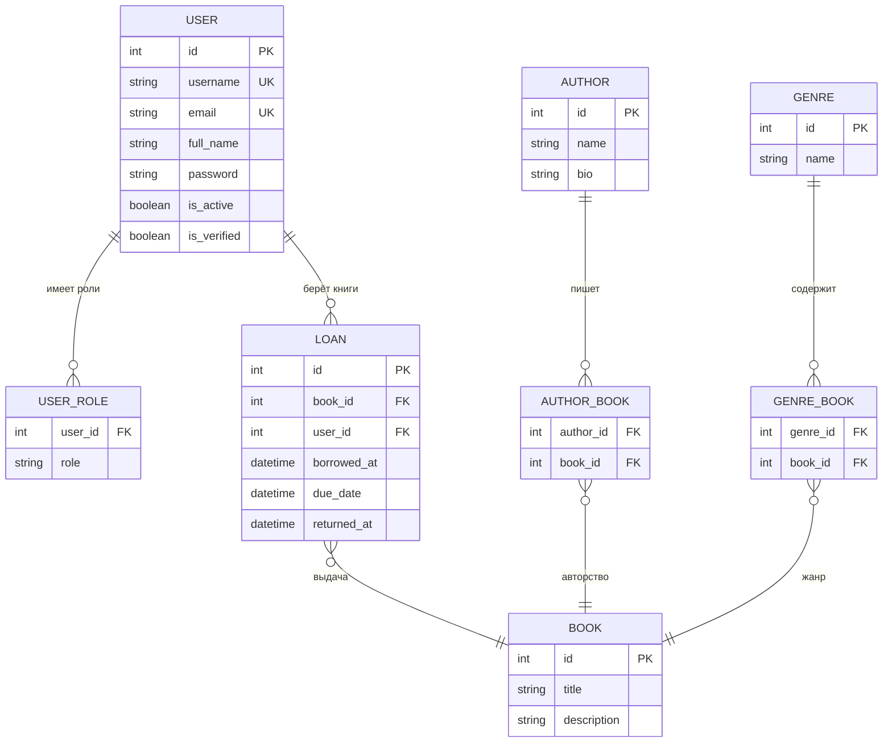

# LiB

Это проект приложения на FastAPI - современном веб фреймворке для создания API на Python. Я использую Pydantic для валидации данных, SQLModel для взаимодействия с базой данных, Alembic для управления миграциями, PostgreSQL как систему базы данных и Docker Compose для легкого развертывания.

### **Ключевые элементы:**

1. FastAPI: Предоставляет высокопроизводительность и простоту для разработки RESTful API, поддерживает асинхронные операции и автоматическую генерацию документации.
2. Pydantic: Используется для валидации данных и сериализации, позволяет легко определить схемы данных.
3. SQLModel: Объединяет SQLAlchemy и Pydantic, включая операции с базой данных с помощью классов Python.
4. Alembic: Инструмент для управления миграциями базы данных, упрощающий отслеживание и применение изменений в схеме базы данных.
5. PostgreSQL: Надежная реляционная база данных для хранения данных.
6. Docker Compose: Упрощает развертывание приложения и его зависимостей в контейнерах.


### **Инструкция по установке**

1. Клонируйте репозиторий:
   ```bash
   git clone https://github.com/wowlikon/libraryapi.git
   ```

2. Перейдите в каталог проекта:
   ```bash
   cd libraryapi
   ```

3. Настройте переменные окружения:
   ```bash
   edit .env
   ```

4. Соберите контейнеры Docker:
   ```bash
   docker compose build
   ```

5. Запустите приложение:
   ```bash
   docker compose up api -d
   ```

Для создания новых миграций:
   ```bash
   alembic revision --autogenerate -m "Migration name"
   ```

Для запуска тестов:
   ```bash
   docker compose up test
   ```

Для добавление данных для примера используйте:
  ```bash
  python data.py
  ```

### **Эндпоинты API**

**Авторы**
| Метод  | Эндпоинты                 | Описание                        |
|--------|---------------------------|---------------------------------|
| POST   | `/api/authors`            | Создать нового автора           |
| GET    | `/api/authors`            | Получить список всех авторов    |
| GET    | `/api/authors/{id}`       | Получить автора по ID с книгами |
| PUT    | `/api/authors/{id}`       | Обновить автора по ID           |
| DELETE | `/api/authors/{id}`       | Удалить автора по ID            |

**Книги**
| Метод  | Эндпоинты                 | Описание                        |
|--------|---------------------------|---------------------------------|
| POST   | `/api/books`              | Создать новую книгу             |
| GET    | `/api/books`              | Получить список всех книг       |
| GET    | `/api/book/{id}`          | Получить книгу по ID с авторами |
| PUT    | `/api/books/{id}`         | Обновить книгу по ID            |
| DELETE | `/api/books/{id}`         | Удалить книгу по ID             |

**Жанры**
| Метод  | Эндпоинты                  | Описание                       |
|--------|----------------------------|--------------------------------|
| POST   | `/api/genres`              | Создать новый жанр             |
| GET    | `/api/genres`              | Получить список всех жанров    |
| GET    | `/api/genres/{id}`         | Получить жанр по ID            |
| PUT    | `/api/genres/{id}`         | Обновить жанр по ID            |
| DELETE | `/api/genres/{id}`         | Удалить жанр по ID             |

**Связи**
| Метод  | Эндпоинты                    | Описание                          |
|--------|------------------------------|-----------------------------------|
| GET    | `/authors/{id}/books`        | Получить список книг для автора   |
| GET    | `/books/{id}/authors`        | Получить список авторов для книги |
| POST   | `/relationships/author-book` | Связать автор-книга               |
| DELETE | `/relationships/author-book` | Разделить автор-книга             |
| GET    | `/genres/{id}/books`         | Получить список книг для жанра    |
| GET    | `/books/{id}/genres`         | Получить список жанров для книги  |
| POST   | `/relationships/genre-book`  | Связать автор-книга               |
| DELETE | `/relationships/genre-book`  | Разделить автор-книга             |

**Другие**
| Метод  | Эндпоинты    | Описание                                     |
|--------|--------------|----------------------------------------------|
| GET    | `/api/info`  | Получить общую информацию о сервисе          |
| GET    | `/api/stats` | Получить статистическую информацию о сервисе |





### **Используемые технологии**

- **FastAPI**: Современный web фреймворк для построения API с использованием Python, известный своей скоростью и простотой использования.
- **Pydantic**: Библиотека для валидации данных и управления настройками, использующая аннотации типов Python.
- **SQLModel**: Библиотека для взаимодействия с базами данных с использованием классов Python, объединяющая функции SQLAlchemy и Pydantic.
- **Alembic**: Легковесный инструмент для миграции базы данных на основе SQLAlchemy.
- **PostgreSQL**: Сильная, открытая реляционная система управления базами данных.
- **Docker**: Платформа для разработки, распространения и запуска приложений в контейнерах.
- **Docker Compose**: Инструмент для определения и запуска многоконтейнерных приложений Docker.
- **Tailwind**: CSS-фреймворк, позволяющий стилизовать веб-интерфейсы, применяя готовые низкоуровневые классы.
- **Cash**: Микро JavaScript-библиотека, созданная как очень быстрая и компактная альтернатива jQuery.
